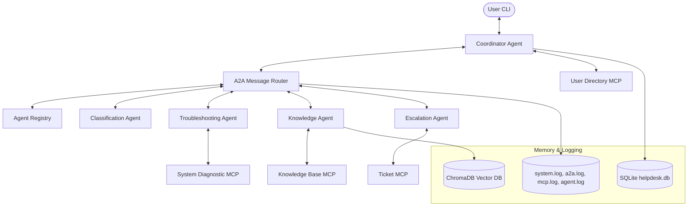
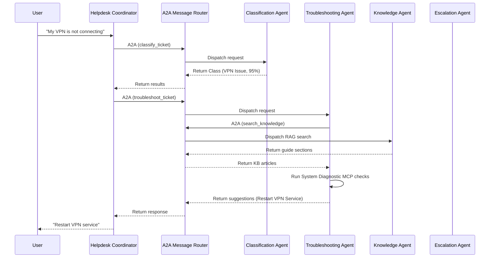

# Autonomous IT Helpdesk System

A production-quality, terminal-based Level-1 IT Support Engineer Multi-Agent System built using the **Google Agent Development Kit (ADK)**, Stdio-based **Model Context Protocol (MCP) Servers**, and an **Agent-to-Agent (A2A)** communication router.

---

## 1. Project Overview

The Autonomous IT Helpdesk System simulates an autonomic L1 corporate support technician. It routes incoming requests through a hierarchy of five specialized agents to classify, troubleshoot (via knowledge guides and live process diagnostics), feedback-verify, or escalate tickets to Level-2 queues.

The system features:
* **Dual Execution Modes**: Swaps between `MODE=mock` (rules engine & fallback hash embeddings) and `MODE=gemini` (LLM-based Gemini model runs & true ADK workflow runners).
* **Correlation Tracing**: Propagates `trace_id` headers across multi-agent turns and records them inside centralized logs alongside ADK `session_id` and SQLite `ticket_id`.
* **Standard MCP Integrations**: Invokes fastmcp servers for user data directories, ticket persistence, ChromaDB vector databases, and mocked hardware/network tests.

---

## 2. Architecture & Design

### Architecture Diagram


### Agent Hierarchy & Functions
1. **Coordinator Agent**: The root-level orchestrator. Initiates database rows, acts as the user's direct conversational interface, evaluates confidence scores, and determines path routing.
2. **Classification Agent**: Evaluates user queries and outputs a category, a summary, and a confidence score.
3. **Troubleshooting Agent**: Synthesizes knowledge guide instructions with live hardware/system checks to construct a diagnostic plan.
4. **Knowledge Agent**: Searches the vector space for matching documentation sections.
5. **Escalation Agent**: Runs if troubleshooting fails or classification confidence is extremely low. Determines the Level-2 team, priority level, and technical handoff notes.

### A2A Communication Flow


### Memory & Persistence Architecture
* **Short-Term Memory**: The ADK Session State tracks ephemeral ticket states (e.g., ticket ID, category, executed checks, retrieved guides, current lifecycle status) to maintain context over multiple turns.
* **Long-Term Memory**: SQLite Database (`helpdesk.db`) persists schemas for Users, Tickets, Conversation turns, Escalation records, and router events.

---

## 3. Demo Screenshots

Screenshots showing system execution (stored in [docs/screenshots/](file:///c:/Users/kmnit/OneDrive/Desktop/Autonomous%20IT%20Helpdesk%20System/docs/screenshots/)):

1. **System Startup Interface**:  
   

2. **IT System Health check Report**:  
   

3. **VPN Diagnostic & Troubleshooting Plan**:  
   

4. **A2A Router Event Trace Logs**:  
   

---

## 4. Installation & Environment Configuration

### Prerequisites
* Python 3.11 or Python 3.12
* Windows, macOS, or Linux

### Installation
1. Clone the repository.
2. Initialize virtual environment:
   ```powershell
   python -m venv venv
   .\venv\Scripts\activate   # On Linux/macOS: source venv/bin/activate
   ```
3. Install dependencies:
   ```powershell
   pip install -r requirements.txt
   ```

### Environment Variables
Configure the active `.env` file in the root directory:
```env
# Execution Mode: 'mock' (default / offline fallback) or 'gemini' (requires API key)
MODE=gemini

# Gemini API Key (Required for 'gemini' mode)
GEMINI_API_KEY=your_gemini_api_key_here
```

---

## 5. Usage & Interactive Commands

Boot the CLI client application:
```powershell
python main.py
```

### Slash Commands
Type these commands at the `User ❯` prompt to query system internals:
* `/help` - Print the command utility list.
* `/health` - Inspect SQLite and ChromaDB online status, log trace volume, and current mode.
* `/agents` - View agent registration maps.
* `/memory` - Dump active ADK session memory context variables.
* `/tickets` - Retrieve a colorized table of tickets from the database.

---

## 6. Logging & Observability

Observability log traces are written to the `logs/` directory:
* `logs/system.log`: Runtime initialization events and vector indices operations.
* `logs/a2a.log`: Inter-agent serialized JSON messaging packets.
* `logs/agent.log`: Model reasoning latencies, fallback logs, and decision states.
* `logs/mcp.log`: MCP server tool calls inputs and returns.

Every log entry format includes trace tracking contexts:
`%(asctime)s - %(levelname)s - [%(trace_id)s] [%(session_id)s] [%(ticket_id)s] - %(message)s`

---

## 7. Troubleshooting & FAQ

#### Q: The application fails with `RESOURCE_EXHAUSTED` (429) rate limit errors from Gemini API.
* **A**: This is due to free tier Google Gemini API limits. The system automatically intercepts API errors and falls back to mock heuristic reasoning rules and hash embeddings. To use standard offline execution without API calls, set `MODE=mock` in your `.env`.

#### Q: The CLI throws character set decoding errors in the terminal.
* **A**: Standard Windows consoles (CP1252) can throw decoding exceptions when attempting to print raw unicode symbols (like arrows or checkmarks). The system outputs clean ASCII representations (`->`, `PASS`, `FAIL`) to ensure compatibility across all command shells.
